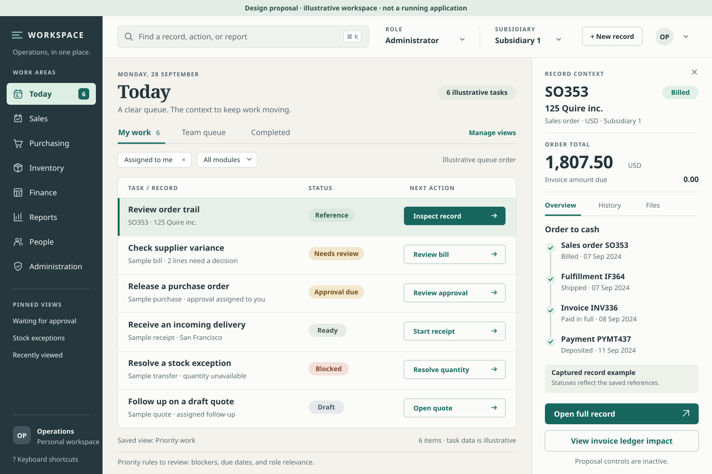

# Workspace concept — static design proposal

This artifact supports design review for a separate ERP product. It is an illustrative workspace, not a running application. Buttons, search, filters, navigation, and status indicators are drawn proposals; they are not connected to data or executable behavior. Implementation awaits design review.

## Intent and visual direction

The intended user is an operations colleague moving between sales, purchasing, inventory, and finance. The workspace should answer three questions quickly: what needs attention, what can I do next, and what happened to this record?

The chosen direction is a calm, information-dense workbench: slate navigation, ivory canvas, white working surfaces, and restrained teal for selection and primary actions. Its central object is a useful task queue. A permanently allocated context panel keeps the selected record visible without a floating dialog obscuring the work list. The composition is 1500 × 1000 pixels and uses vector geometry and local font fallbacks; it contains no remote assets, vendor logos, HTML scaffolding, or application code.

## What the composition proposes

| Area | Design decision | Intended benefit |
| --- | --- | --- |
| Left navigation | Today, Sales, Purchasing, Inventory, Finance, Reports, People, Administration; pinned views below | A stable mental map across modules, with shortcuts for recurring work. |
| Command bar | Search for records/actions/reports; visible role and subsidiary | Fast access without losing the context that controls which records and actions apply. |
| Today workspace | Six task rows with the source record, readable state, and explicit next action | Make work actionable without interpreting a wall of summary metrics. |
| Views and filters | My work, Team queue, Completed; assignment/module filters and a saved-view label | Keep the active scope visible and reproducible. |
| Selected row | Teal edge, pale green surface, persistent record identity | Selection remains visible independently of color alone. |
| Record context | Order total, invoice balance, linked order-to-cash records, next inspection actions | Reduce cross-module navigation while preserving the original document identities. |
| State presentation | Written labels such as Blocked, Approval due, Shipped, and Paid in full | Status stays understandable without relying only on color or icons. |

The right panel is a record preview, not a full editing form. The proposed “Open full record” action would lead to an expanded document workspace; wide item tables should not be forced into this narrow panel. The compact chain would expand into related-document detail for partial shipments, multiple invoices, returns, or reversals.

The queue is arranged for illustration, with the captured reference first. A future priority rule combining blockers, due dates, and role relevance is proposed for review; this static order does not claim to demonstrate an implemented ranking algorithm.

## Evidence versus illustrative content

The SO353 example is grounded in locally saved NetSuite references. It preserves the observed record identity, customer, currency, subsidiary, total, and linked records:

| Fact shown | Saved reference |
| --- | --- |
| SO353; 125 Quire inc.; Billed; Subsidiary 1; USD; total 1,807.50 | [Sales-order detail](../references/netsuite/sales-order-detail.md), [captured screen](../references/netsuite/06-sales-order-detail.png) |
| IF364, Shipped; INV336, Paid In Full | [Sales-order related records](../references/netsuite/sales-order-related.md) |
| Invoice amount due 0.00; payment PYMT437, Deposited, amount 1,807.50 | [Invoice related records](../references/netsuite/invoice-related.md) |

Dates are displayed in day–month–year words to remove visual ambiguity. The captured September 2024 chain is a historical reference example; it is not presented as current work. The active role label, Administrator, also matches the saved capture. The surrounding six tasks, their prioritization, the operations workspace, pinned views, and control placement are illustrative proposals. The selected “Review order trail” task is also illustrative; the capture does not establish that someone has been assigned such a task. All other queue rows explicitly identify their records as samples. No live account was accessed to make this artifact.

## Alternatives and tradeoffs

The selected queue-plus-context arrangement supports frequent triage and handoffs. A dashboard with prominent financial and operational totals could help management overview, but would give the next action less space. A full-width transaction table would fit more columns and support reconciliation, but would require navigation or expansion to inspect related records. The proposed product should use those other arrangements where the task calls for them; this concept is the Today workspace, not a universal page template.

The right panel reduces repeated navigation but consumes 380 pixels of width. At smaller viewport sizes, the proposed behavior is to show the queue and context in separate views with preserved filters and scroll position. The SVG does not implement responsiveness.

## Typography, spacing, and contrast

- Primary body text is 16–17 px, secondary text 14 px, and sparse uppercase labels 12 px. The 13 px text is a shortcut, count, or supplementary annotation; essential record/task details use at least 14 px.
- The local type stack is Avenir Next → Trebuchet MS → sans-serif. Rendering should be checked when the first font is unavailable. The design uses a 32 px content margin and a consistent 80–81 px task-row rhythm.
- Text colors are dark slate `#24343B`, muted slate `#586971`, and teal `#11685F`; main surfaces are ivory `#F3F2EC` and white `#FBFCF9`. The navigation uses `#24383E` with light text. Primary-action text is white on `#17675F`.
- Warning and blocked states combine written text and distinct surface treatments. Selected rows also have an edge rule; completed flow nodes also have check shapes and words.
- This static artifact can demonstrate visual contrast and geometry. Keyboard order, screen-reader behavior, actual focus indicators, responsive reflow, and working accessibility require later implementation and validation.

## Proposed interactions for review

Selecting a queue row would update context while preserving the queue. Search would distinguish records, actions, and reports. State-changing actions would open the appropriate review/edit workflow and verify permissions and business rules; the drawn labels do not imply one-click posting or payment. Role/subsidiary switches would refresh authorized data while preserving recoverable drafts. Saved views would retain filters and columns, but never grant additional access.

The design follows the research themes of role workspaces, saved views, list/record continuity, explicit document states, and an actionable process trail. See [ERP UX research](../research/erp-ux-patterns.md). Those are design intentions, not measured improvements or verified feature parity.

## Review focus

Review the information hierarchy, everyday terminology, task-row density, and whether 380 pixels is enough for the useful record summary. Confirm whether the Today page should prioritize individual assignments, operational exceptions, or a combination. The approved design and account-specific requirements should determine an implementation plan before any product work begins.

## Artifact validation

The SVG parsed successfully as XML, contains no scripts, and was rendered locally to [a 1500 × 1000 PNG preview](workspace-concept.png) with the already-installed Sharp library. The rendered composition was inspected for clipping and text overlap. Checked body, muted, navigation, primary-action, reference, warning, and blocked text/background pairs have contrast ratios of at least 5.10:1. These artifact checks do not validate a working application's accessibility or behavior.
