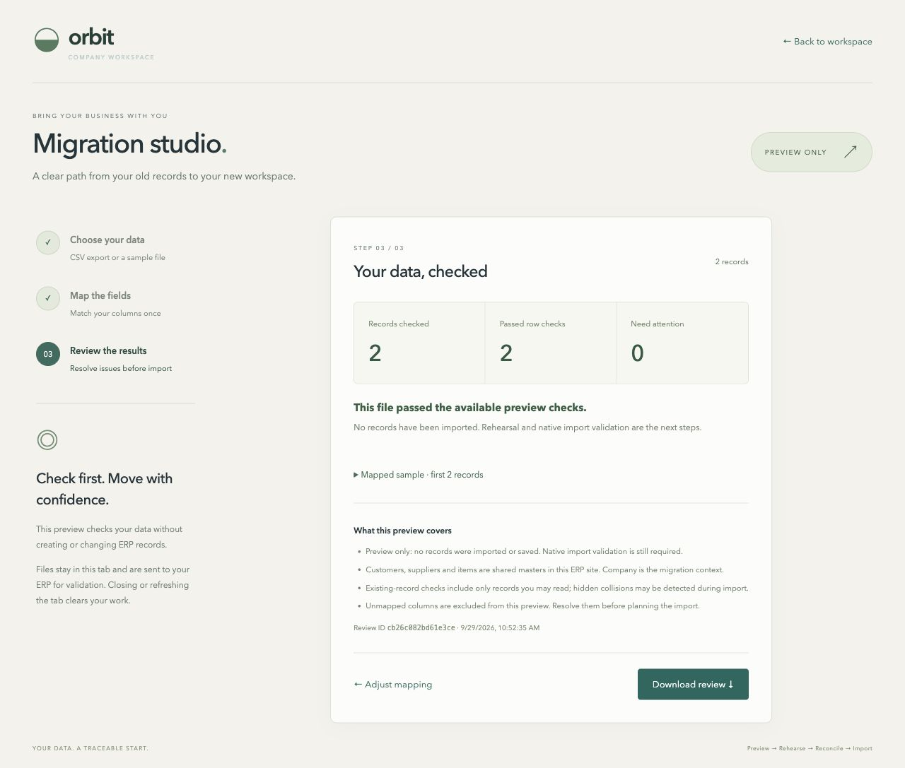
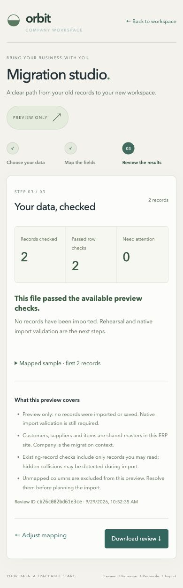

# Migration preview verification — 2026-09-29

Release image: `orbit-erp:786ce91d2e6abf7d`.

Open `/orbit?view=migration` on the local ERP at `http://127.0.0.1:8080`. The workspace sidebar exposes Migration studio to system managers. Login preserves the destination.

## Delivered behavior

- Three steps: select CSV/type/company, map columns, review validation results.
- Customer, supplier and item master previews; static synthetic examples and header templates.
- UTF-8 input bounded to 2 MiB, 5,000 records, 64 columns and 4,096 characters per cell. Identifiers remain strings, including leading zeros. CSV record numbers count quoted multiline values as one record.
- Required mappings, required values, supported choice/boolean values, duplicate source IDs and duplicate target identifiers. Ambiguous normalized headers remain unmapped for the user to resolve.
- Native permission-filtered reference and existing-record queries. Administrator/System Manager and target read/create/import rights are required; company must be a single permitted exact name.
- Full-file valid/invalid/issue counts, at most 200 displayed issues, bounded samples, explicit unmapped columns and clear preview limitations.
- Browser-memory source data, request timeouts/cancellation and stale-response guards. No file, migration receipt or business record is saved by preview.
- JSON review contains source filename, mapping, counts, issues, fingerprint, timestamp and limitations. It excludes source contents and sample rows. The fingerprint is provenance, not an import authorization.

## Automated evidence

`npm run build` in `web` passed TypeScript and Vite compilation. `scripts/build-workspace` installed the image above. `scripts/test-engine` exited 0 on that image with **55 tests passing**:

| Suite | Tests |
| --- | ---: |
| Runtime/session/realtime smoke | 10 |
| Pure migration CSV parser | 10 |
| Native business journeys | 4 |
| Workspace permissions and records | 11 |
| Draft command behavior | 9 |
| Migration authorization and reference checks | 7 |
| Concurrent draft HTTP commands | 2 |
| Migration HTTP/session/CSRF | 2 |

Local logs: `.runtime/migration-release-build.log` and `.runtime/migration-release-tests.log` (ignored by Git).

Tests first reproduced the missing parser and endpoint, then passed after implementation. Further failing regressions caught non-string company query inputs and ambiguous normalized header suggestions. Both were corrected. A fresh reviewer inspected the parser, authorization boundary and React request lifecycle; its material header-ambiguity finding is fixed.

Database tests verify unchanged Customer, Supplier, Item and File counts after preview and roll back their fixtures. They exercise nonmanager/guest denial, native target rights, restricted references, exact company validation and accurate counts beyond the issue cap. HTTP tests verify CSRF rejection and disallow GET requests to preview.

## Browser evidence

Chrome verified against the running image:

- Customer, supplier and item examples each returned 2 checked, 2 passed, 0 requiring attention.
- Unterminated CSV quotes produced a readable error; choosing a valid example recovered in the same tab.
- Removing a required customer-name mapping disabled validation; restoring it allowed validation.
- A three-record customer sample with duplicate IDs, an unavailable group and an existing customer returned 0 passed, 3 requiring attention, and 4 issues. Its extra legacy column stayed visibly unmapped.
- Moving back to mapping/source and changing record type cleared the old result.
- Downloaded review JSON was read from the Downloads directory: counts matched the visible preview, `preview_only` was true, and `sample`, `rows` and `content` were absent. The browser tool's download event timed out even though Chrome saved both files; file inspection confirmed the downloads.
- At a 390 × 844 viewport, page scroll width was exactly 390. The viewport override was reset after capturing evidence. No browser console errors were recorded in the final verification tab.

The file-picker automation could not run because the Chrome extension's “Allow access to file URLs” permission was disabled. No browser permission was changed. Pasted CSV and built-in sample flows were verified; automated real-file selection remains unverified.

## Scope limits and next implementation

This is a read-only preparation release. It does not import records, save resumable batches, validate every native ERP rule, reconcile opening balances, or execute a production cutover. A passing row may still fail native import (for example, leaf-group requirements or custom-field validation). Existing-record checks only include records the user can read; shared masters are not made company-owned by choosing a company.

Next migration work is durable batches, explicit source-to-target links, native validation/rehearsal, reconciliation and controlled idempotent import. The approved role/access audit, detailed manufacturing workflows, Philippine accounting localization, user-selected AI/storage and production hardening remain separate pending work. This release establishes neither complete NetSuite parity nor BIR compliance. Private NetSuite role details remain unavailable while site access is blocked.
