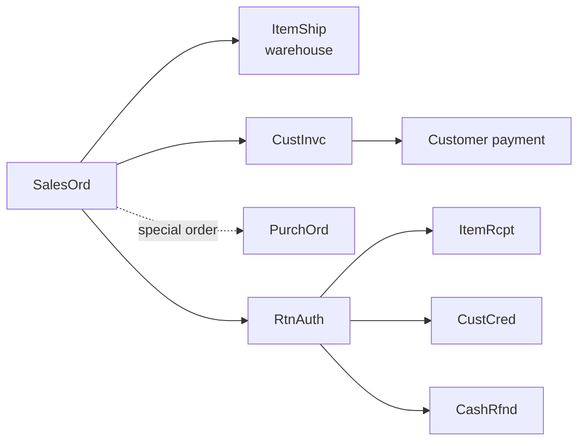

# 1. Sales department

Study time: about 15 minutes. Prerequisite: [00-how-netsuite-code-works.md](00-how-netsuite-code-works.md).

## What sales does
It takes the customer's order, gets the goods out (with the warehouse), bills the customer, collects payment, and handles returns.

## Documents and status codes
### Sales order: `SalesOrd`
| Code | Status | Meaning |
|---|---|---|
| A | Pending approval | Waiting for a manager |
| B | Pending fulfillment | Approved; nothing shipped yet |
| D | Partially fulfilled | Some lines or quantities shipped |
| E | Pending billing / partially fulfilled | Some shipped and not yet billed, more still to ship |
| F | Pending billing | All shipped, not yet billed |
| G | Billed | Done |

(Other letters exist in NetSuite, such as cancelled and closed, but weren't seen in this account.)

### Cash sale: `CashSale`
| Code | Status |
|---|---|
| C | Deposited |

Sale, stock deduction and payment happen in **one** document. This is the walk-in counter pattern.

### Invoice: `CustInvc`
| Code | Status |
|---|---|
| A | Open (money owed) |
| B | Paid in full |

### Credit memo: `CustCred`
| Code | Status |
|---|---|
| A | Open (credit not yet used) |
| B | Fully applied |

### Return authorization: `RtnAuth`
| Code | Status |
|---|---|
| A | Pending approval |
| B | Pending receipt (waiting for goods back) |
| F | Pending refund |
| G | Refunded |

### Cash refund: `CashRfnd`
Posts with no status lifecycle (`Y`).

## The flow

Typical timing in the studied account: shipment about 1.3 days after the order, invoice about 1.1 days after, and returns about 39 days after the sale.

## Key fields to know
| Field | Table | Meaning |
|---|---|---|
| `tranid` | transaction | Document number shown to people |
| `trandate` | transaction | Document date |
| `entity` | transaction | Customer |
| `status` | transaction | One-letter status |
| `item` | transactionline | Item sold |
| `quantity` | transactionline | Quantity ordered |
| `quantityshiprecv` | transactionline | Quantity shipped so far |
| `quantitybilled` | transactionline | Quantity billed so far |
| `isclosed` | transactionline | Line closed (won't ship) |
| `createdfrom` | transactionline | Parent document |

The status is basically **derived** from `quantity`, `quantityshiprecv` and `quantitybilled`. Understanding that is the key insight of this department.

## Automation in this department (SuiteApps)
| SuiteApp (prefix) | Scripts | What it does |
|---|---|---|
| Pricing (`edp`) | 11 | Validates and mass-updates customer and customer-group prices |
| Order availability (`atb`) | 4 | Checks promised availability on sales orders |
| Returns/case link (`rac`) | 6 | Links support cases to transaction lines for returns |
| Supply chain (`scm`) | part of 63 | Customer part numbers on items and transactions |
| First-invoice check (`iaw`) | 1 | Workflow action: "is this the customer's first invoice?" |

## Try it (SuiteQL)
```sql
-- Where are open orders stuck? (BUILTIN.DF can't be used with GROUP BY, so read the letters with the table above)
SELECT status, COUNT(*) AS n
FROM transaction WHERE type = 'SalesOrd' AND status IN ('A','B','D','E','F')
GROUP BY status ORDER BY status;

-- Lines shipped but not billed
SELECT COUNT(*) FROM transactionline tl JOIN transaction t ON t.id = tl.transaction
WHERE t.type = 'SalesOrd' AND tl.mainline = 'F' AND tl.quantityshiprecv > tl.quantitybilled;
```

### Results (run 2026-09-29)
| Status | Open orders |
|---|---|
| A Pending approval | 3 |
| B Pending fulfillment | 44 |
| D Partially fulfilled | 13 |
| E Pending billing / partially fulfilled | 1 |
| F Pending billing | 21 |
| **Total open** | **82** |

Order lines shipped but not yet billed: **33**.

**How to read it:** most open orders are waiting on the *warehouse* (B and D, 57 orders), not on billing. The 21 orders in F are shipped goods that haven't been invoiced yet, which is money the business is waiting to bill. A daily "shipped, not billed" check catches this.

## Quiz yourself
1. What's the difference between a sales order and a cash sale?
2. An order is fully shipped but not billed. What status?
3. A return was approved but the part hasn't come back. What status?
4. Which three line fields decide an order's status?
5. What are the two ways a customer can get money back after a return?

<details><summary>Answers</summary>

1. A sales order separates the order, shipping and billing into different steps. A cash sale does all of it, plus payment, at once.
2. F, Pending billing.
3. B, Pending receipt.
4. `quantity`, `quantityshiprecv` and `quantitybilled`.
5. A credit memo (store credit) or a cash refund.
</details>

## What this means for our ERP
- Release one uses the **cash-sale** pattern at the counter: one atomic posting.
- Keep `fulfilled_qty` and `billed_qty` on sale lines from day one, even though they're equal in release one. That makes sales orders a later add-on, not a rewrite.
- Compute document status from line quantities. Never let people type it.
- Returns must reference the original sale line (already in our spec).
