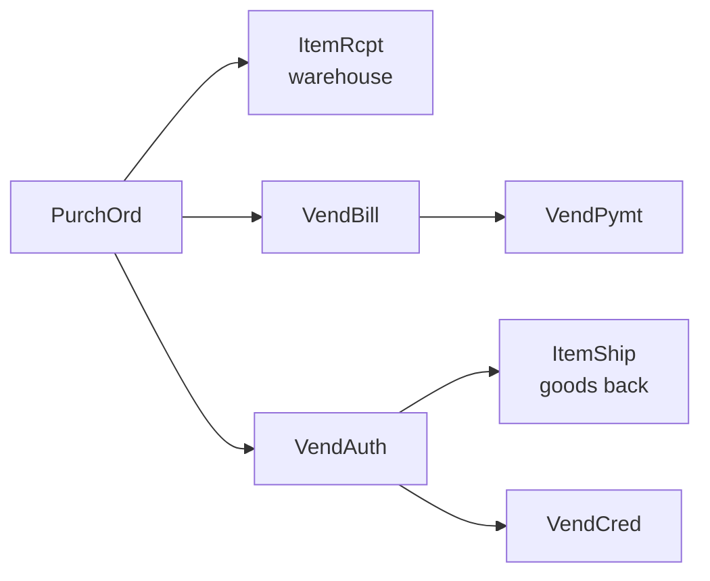

# 2. Purchasing department (and accounts payable)

Study time: about 15 minutes. Prerequisite: [00-how-netsuite-code-works.md](00-how-netsuite-code-works.md).

## What purchasing does
It orders stock from suppliers, receives it (with the warehouse), checks the supplier's bill, pays it, and sends back bad goods.

## Documents and status codes
### Purchase order: `PurchOrd`
| Code | Status | Meaning |
|---|---|---|
| A | Pending supervisor approval | Needs a manager before it's sent |
| B | Pending receipt | Sent; nothing received |
| D | Partially received | Some goods arrived |
| E | Pending billing / partially received | Some received and billed, more to come |
| F | Pending bill | All received, no bill yet |
| G | Fully billed | Done |

### Vendor bill: `VendBill`
| Code | Status |
|---|---|
| D | Pending approval |
| A | Open (we owe money) |
| F | Payment in transit |
| B | Paid in full |
| E | Rejected |

### Bill payment: `VendPymt`
| Code | Status |
|---|---|
| B | In transit |
| Y | Posted (no lifecycle) |

### Vendor return authorization: `VendAuth`
| Code | Status |
|---|---|
| B | Pending return (goods not sent back yet) |
| F | Pending credit |
| G | Credited |

### Bill credit: `VendCred`
Posts with no lifecycle (`Y`). It reduces what we owe a supplier.

## The flow

Typical timing: receipt about 2.6 days and bill about 2.3 days after the order. Receiving and billing are **independent**; either can come first.

## Three-way match
The classic control: before paying, compare **what we ordered** (PO), **what arrived** (receipt) and **what they charged** (bill). Bill approval (status D) is where a mismatch gets caught. The account has a small `3way` workflow action that checks that subsidiary fields match.

## Automation in this department (SuiteApps)
| SuiteApp (prefix / bundle) | Scripts | What it does |
|---|---|---|
| Electronic Bank Payments (`2663`, `15486`, `15767`, `8859`, `8858`, `9997`, `ep`, and others) | over 130 across bundles | Builds bank payment files (ACH/NACHA, EFT), payment batches, batch approval and rejection notifications, bank detail validation |
| Vendor prepayment (`12793`) | 1 | Applies supplier prepayments to bills |
| Bank fee schedule (`11724`) | 2 | Bank fees on payments |

**Lesson:** paying suppliers electronically is a big area. Much of the automation in this account is just payment files and approvals.

## Try it (SuiteQL)
```sql
-- Purchase orders waiting on goods
SELECT COUNT(*) FROM transaction WHERE type = 'PurchOrd' AND status IN ('B','D','E');

-- Bills awaiting approval
SELECT COUNT(*) FROM transaction WHERE type = 'VendBill' AND status = 'D';
```

## Quiz yourself
1. All goods arrived but there's no supplier bill yet. What PO status?
2. Name the three documents in a three-way match.
3. What's the difference between `VendAuth` and `VendCred`?
4. Why does a bill have a "pending approval" status?

<details><summary>Answers</summary>

1. F, Pending bill.
2. The purchase order, the item receipt and the vendor bill.
3. `VendAuth` is permission to send goods back; `VendCred` is the money credit we get.
4. Separation of duties: the person entering a bill shouldn't also be the one approving payment.
</details>

## What this means for our ERP
- Release one: PO → partial receipts, with status derived from quantities (already in plan task 4).
- Leave room on PO lines for `billed_qty`, for when supplier bills arrive in a later release.
- Supplier bills, payments and returns stay in the backlog. When we build them, include a three-way-match check and bill approval.
- Electronic bank payment files are a whole product area. Don't start there.
