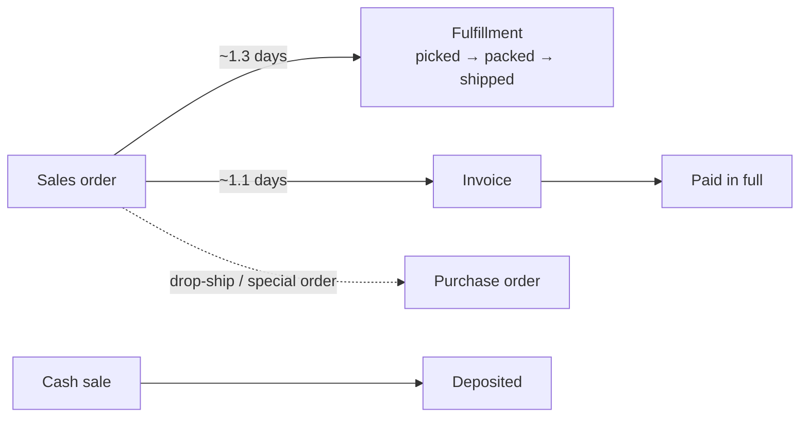
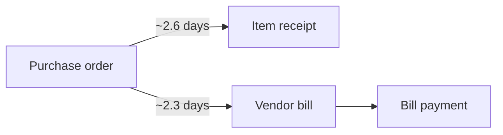
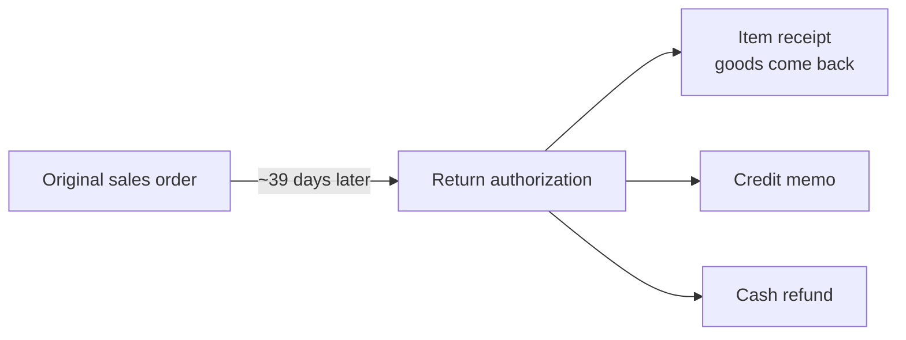
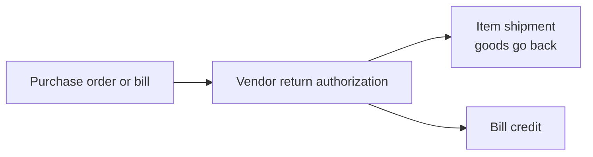

# Observed workflows

Source: read-only SuiteQL study, 2026-09-29. Counts are approximate volumes in the studied account and only show which paths are common.
"Days" means the average number of calendar days between the parent and child document dates.

## 1. Order-to-cash (sell a part)

**Sales order states**
Pending approval → Pending fulfillment → Partially fulfilled → Pending billing / partially fulfilled → Pending billing → Billed.

**Fulfillment states:** Picked → Packed → Shipped.

**Invoice states:** Open → Paid in full.

**What we learned**
- Fulfilling (stock leaves the shelf) and billing (money is owed) are separate steps with separate documents. One order can be fulfilled or billed in several parts.
- Almost every order ends in "Billed". Only a few sit in approval or partial states, so the partial states handle exceptions and the main path is short.
- A small number of sales orders create a purchase order directly. This is the special-order path: the customer wants a part the shop does not stock.
- A cash sale does sale, stock deduction and payment in one document. This is what a walk-in counter sale looks like.
- About 2% of invoices were still open at study time, which shows receivables (customer credit) are in use.

## 2. Procure-to-pay (buy stock)

**Purchase order states**
Pending supervisor approval → Pending receipt → Partially received → Pending billing / partially received → Pending bill → Fully billed.

**Bill states:** Pending approval → Open → Payment in transit → Paid in full (or Rejected).

**What we learned**
- Receiving goods and receiving the supplier's bill are independent. Either can happen first, and the purchase order tracks both.
- Purchase orders can require supervisor approval before they are sent.
- Partial receipts are normal and are tracked by status, not by editing the order.
- Bills can require approval before payment (a separation-of-duties control).

## 3. Returns

### Customer returns

Return authorization states: Pending approval → Pending receipt → Pending refund → Refunded.

- A return always references the original sale.
- Approval comes before goods are accepted.
- Receiving the goods and refunding the money are separate steps. The refund can be a credit memo (store credit) or a cash refund.

### Vendor returns

Vendor return states: Pending return → Pending credit → Credited.

## 4. Inventory control
| Activity | Document | States seen | Notes |
|---|---|---|---|
| Correct stock | Inventory adjustment | posted | Rare compared with receipts and shipments |
| Physical count | Inventory count | Completed / pending approval → Approved | Counting and approving are separate |
| Move between locations | Transfer order → shipment → receipt | Pending fulfillment → Pending receipt → Received | Stock is in transit between ship and receive |
| Move between bins | Bin transfer, bin putaway worksheet | posted | Shelf-level location tracking |
| Revalue stock | Inventory worksheet | posted | Cost change, not a quantity change |

## 5. Approval gates observed
Sales order, purchase order, vendor bill, return authorization, inventory count and expense report each have an approval state before they take effect.

## 6. Data-quality observations
Some linked documents have dates *earlier* than their parent (for example a return receipt dated before its return authorization). Our ERP should use server timestamps for posting time and reject or flag child documents dated before their parent, unless a manager backdates them with a reason.

## 7. Master data shape
- Items: mostly stocked inventory parts, plus assemblies (kits), non-stock parts, service, other-charge, discount and group items.
- Multiple subsidiaries plus an eliminations entity: a multi-company setup. This is far beyond our first release.
