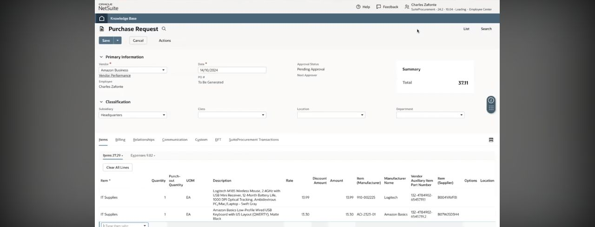
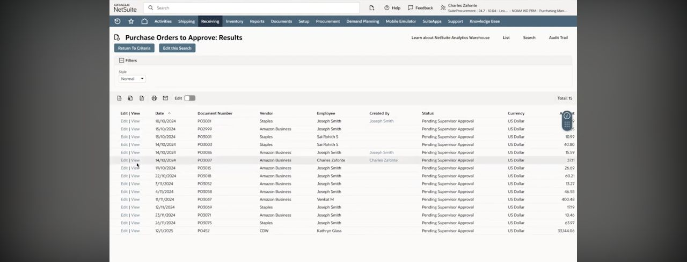
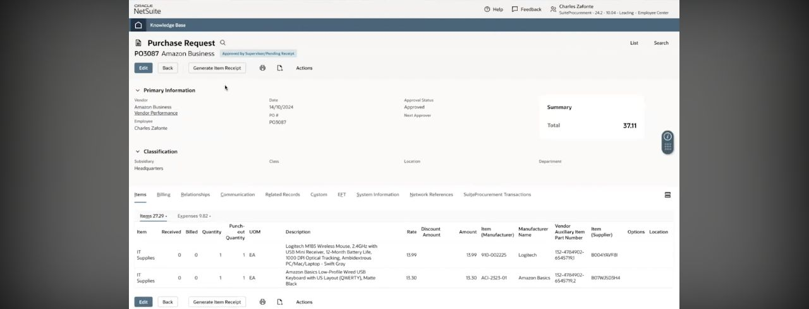

# Public NetSuite screen references

Captured 2026-09-29 from the official NetSuite channel's [SuiteProcurement demo](https://www.youtube.com/watch?v=wtRY8TQB_FE). These are sampled video frames, not screenshots from the user's training account and not evidence that its SuiteProcurement integration is enabled. Copyright remains with the original publisher. Keep source attribution with these research references; do not use them as application assets.

The complete auto-generated English transcript was read. Three frames were inspected visually; the full video was not watched continuously. The video demonstrates an employee buying from an approved supplier, returning purchase details to NetSuite, sending the request for approval, a manager approving it, and the employee generating a receipt. Its narration also describes automatic vendor billing. Those actions were demonstrated by the publisher, not executed or tested in this project.

## Purchase request at 1:26

The frame shows supplier and employee identity, approval status, subsidiary, purchase lines, and a total. Preserve the information while reducing the navigation and field burden in the redesigned flow.

## Approval queue at 2:09

The queue shows purchase order, vendor, employee, creator, approval status, currency, and amount. A useful redesign keeps the list visible while showing details and the permitted approval action beside it.

## Approved request awaiting receipt at 2:44

PO3087 shows an approved request pending receipt, with **Generate Item Receipt** available and line-level received/billed values. This frame precedes receipt submission; it does not establish successful stock or ledger posting.

## Proposed acceptance scenario derived from this reference

1. Employee prepares a purchase request with vendor, company context, and lines.
2. Submission places it in the assigned approver's queue and makes its status visible to the employee.
3. An authorized approver inspects the details and approves or rejects it with an audit event.
4. Approved quantities become eligible for receipt. Partial receipts remain visible per line.
5. Billing follows the configured matching policy; external supplier transmission and automatic vendor billing require a separately verified connector.

The source video is a SuiteProcurement integration example. It must not be generalized to every NetSuite purchase order or to a functioning Amazon Business integration in the new application.
