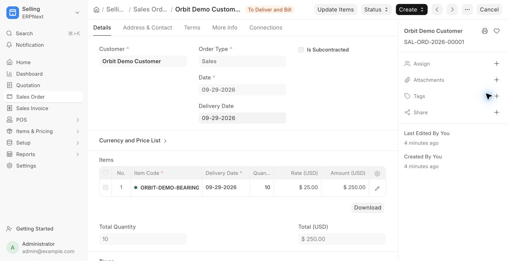

# Local ERP runtime verification — 2026-09-29

## What is running

- URL: http://127.0.0.1:8080/desk
- ERPNext 16.36.1, Frappe 16.35.0, confirmed with `bench --site frontend list-apps`.
- Digest-pinned official ERPNext, MariaDB 11.8 and Redis 6.2 images; see `infra/versions.json`.
- Lima 2.2.0, Apple VZ, ARM64, 4 CPUs / 4 GiB memory / 12 GiB virtual disk.
- Database, sites, files, logs and queue data use persistent volumes. The VM has no host filesystem mounts. The web service binds to host loopback only.
- Web/backend, realtime, two workers, scheduler, database and queues are running. Site creation and configurator both exited successfully. Scheduler was explicitly enabled.

## Observed tests

`scripts/test-engine` passed after a complete `scripts/erp stop` → `scripts/erp start`, and passed again after replaying `scripts/setup-demo`:

1. Login page is served without a traceback.
2. Administrator login succeeds; authenticated identity and company API agree.
3. A guest request for company records is denied (401/403).
4. A persisted submitted sales order remains 40% delivered and 40% billed; its USD 100 invoice is submitted and fully paid; exactly one submitted payment application exists; invoice/payment journal entries balance in the correct company; stock is 96 units.

The sales test was first run before fixture creation and failed because the expected order did not exist. It passed after executing ERPNext's native document controllers. The startup test initially failed with connection refused before services existed. These are integration checks against the real local engine, not mocked responses.

The fixture was replayed and returned the same document identifiers. Re-running the test still found one payment and the same remaining stock. This verifies fixture idempotence, not concurrent command idempotence for future custom APIs.

## Synthetic records retained

| Record | Identifier |
| --- | --- |
| Company | Orbit Demo Company |
| Customer | Orbit Demo Customer |
| Item | ORBIT-DEMO-BEARING |
| Opening stock | MAT-STE-2026-00001: 100 units |
| Sales order | SAL-ORD-2026-00001: 10 units × USD 25 |
| Delivery note | MAT-DN-2026-00001: 4 units |
| Invoice | ACC-SINV-2026-00001: USD 100 |
| Payment entry | ACC-PAY-2026-00001: USD 100 applied |

These are development records, not migrated NetSuite transactions. No external payment was sent.

## Backup and browser evidence

- `scripts/erp backup` produced the database dump, public/private file archives and site configuration, then copied all four to `.runtime/backups` on the host with private file permissions.
- Backup creation and file transfer are verified; a restore rehearsal remains pending.
- Browser sign-in and the demo company were verified. After restart the browser opened SAL-ORD-2026-00001 with the correct customer, 10 units and USD 250 total.
- Native ERPNext is the currently available UI. This does not claim the proposed interface redesign is delivered.

## Outstanding requirements

The full goal remains active. Pending work includes the custom frontend, all other workflow/exception coverage, account data migration, the 83 detailed role configurations, active-role enforcement, numeric compatibility beyond the tested scenario, broader procurement/manufacturing validation, AI integration, load testing, restoration and company release readiness.

The user reported NetSuite unblocked, but the browser tool's fresh attempt still returned a saved permission block for `td3118036.app.netsuite.com`. No alternate access method was used. Private-account audit and exact-role parity remain pending independently of the running local engine.

## Purchasing validation added

The current suite passes **7 integration checks** (3 HTTP/session checks and 4 business checks). New coverage uses a separate synthetic stock item so the sales fixture stays independently verifiable.

- Purchase order `PUR-ORD-2026-00001`: 20 units at USD 12.
- Receipt `MAT-PRE-2026-00001`: 8 units, leaving 12 units unreceived.
- Supplier invoice `ACC-PINV-2026-00001`: USD 96, linked to the receipt and order.
- Payment `ACC-PAY-2026-00002`: USD 96 paid to the synthetic supplier; no external funds moved.
- Order remains 40% received / billed; bill outstanding is zero; receipt, invoice and payment GL entries balance within the demo company.
- Fixture replay returns identical IDs, with one receipt, invoice and payment and stock still at 8 units.
- A 21-unit additional receipt is rejected with the engine's `OverAllowanceError` and produces no stock ledger entry.
- A 2-unit supplier return posts successfully, temporarily reduces stock to 6 and produces balanced GL entries. That test rolls its transaction back to leave the retained demo stock at 8. It does not yet cover a supplier credit note/refund.

The new persisted-journey test first failed because the purchase order was absent, then passed after the native-controller fixture ran. Exception tests exercise existing upstream behavior; no upstream logic was changed. Logs are local under `.runtime/purchasing-*.log`. This does not establish source-account procurement parity or redesigned UI completion.

