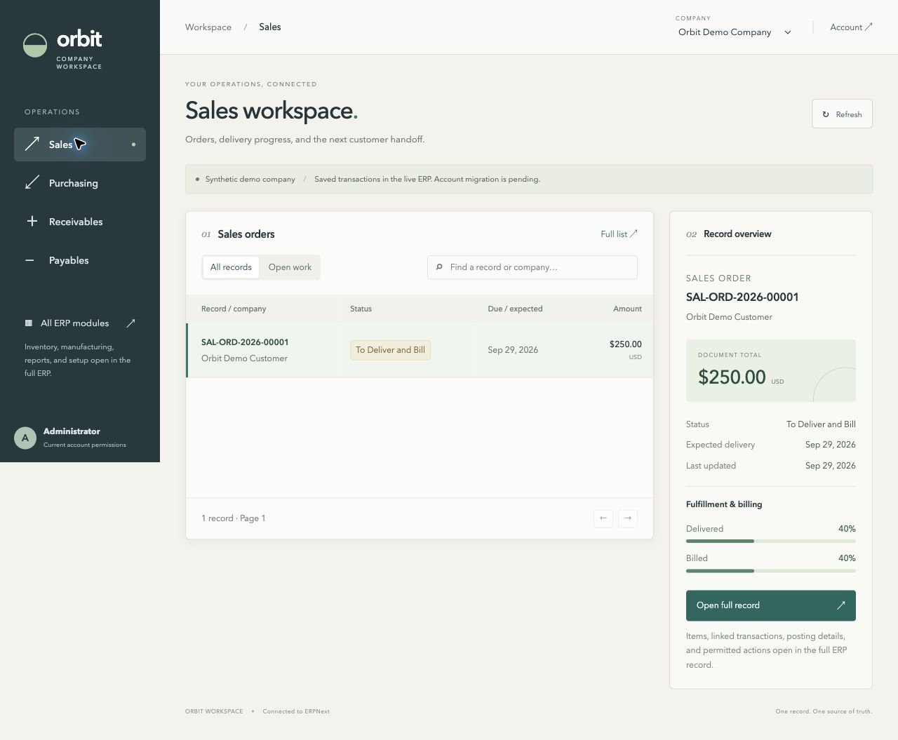
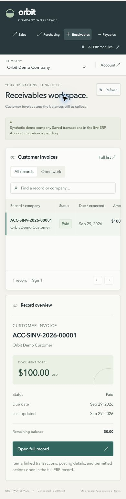
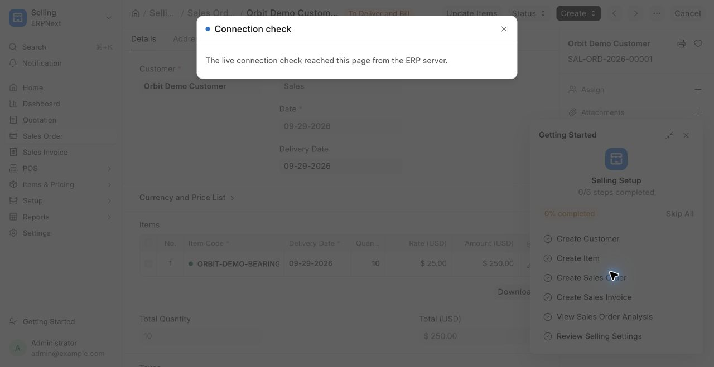

# Connected workspace verification — 2026-09-29

## Delivered implementation

`http://127.0.0.1:8080/orbit` serves a React/TypeScript interface from the custom `quarter_erp` Frappe app. The same authenticated cookie/session serves the workspace and native record pages. There is no browser administrator token or separate ledger.

Four connected views expose sales orders, purchase orders, customer invoices and supplier bills. Company selection, server-side search, open/all filters, bounded pagination, selected-record summaries, fulfillment/billing percentages and outstanding balances use live permitted ERP data. Full list and full record links explicitly open native ERPNext. Remaining modules are reached through the native ERP launcher.

The visual direction implements the slate navigation, ivory canvas, restrained teal selection and adjacent record context from the design proposal. Record editing, task assignment queues, saved views, source role switching and command-based posting are still pending.

## Integration evidence

`scripts/test-engine` passes 14 checks: 4 HTTP/session checks, 4 business journey checks and 6 workspace permission/data tests. Permission tests were run before the custom app existed and failed with a missing-module error; after implementation they pass against the real site.

- Guests cannot call the workspace API; the workspace page redirects to native login.
- Administrator receives the actual demo company and sales/purchase records.
- A synthetic Employee user without sales access is denied; fixture user changes are rolled back.
- An invalid company is rejected before record queries.
- Searches with no match, invalid sections, negative pages and literal wildcard input are covered.
- Twenty-one additional temporary draft orders exercise the 20-record page bound, next-page availability and non-overlapping results. Drafts are rolled back.
- The open-receivables filter excludes the retained fully paid customer invoice.
- Existing persisted sales, purchases, stock, payment and ledger checks remain green.

These tests do not yet establish two-company isolation with differing grants, field-level permission behavior across all roles, or the 83 NetSuite role definitions.

## Browser evidence

Observed in Chrome: real sales and purchasing records, 40% delivered/received and billed progress, search empty-state recovery, paid customer invoice with zero remaining balance, and full-record navigation to its native invoice page. Native browser login remains active across image rebuilds. Mobile tested at 390 × 844 with document width equal to viewport width; the wide table scrolls within its panel. Viewport override was reset afterward.

The build uses locked dependencies and a digest-pinned ERPNext base. Static file URLs include content hashes. The image installs the custom Python app and bakes its asset link into the upstream permanent asset directory, so service recreation does not hide the UI.

## Known unfinished work

All source-account migration and detailed role parity remain pending. The current account's combined ERPNext grants apply; there is deliberately no misleading active-role selector. Financial precision/currency compatibility and complete workflow/exception coverage remain open. The native realtime proxy mismatch was subsequently corrected and verified; see the realtime section below. Current workspace reads do not depend on socket.io.

No performance SLA, crash-free behavior, production readiness or completed clone is claimed.

## Outage recovery

Stopped the local backend service while the workspace remained open. Refresh displayed “We couldn’t open this view” with Retry; stale records were removed. Restarted the service, clicked Retry and verified the invoice returned, then navigated back to the live sales order. This verifies recovery from the tested HTTP failure, not every timeout/failure mode. A 15-second client deadline also exists but was not separately forced in this browser test.

## Realtime correction

The suite now passes **19 checks** (9 HTTP/session/realtime, 4 business journey, 6 workspace). New transport checks cover authenticated local connections, same-origin browser polling without an Origin header, missing sessions, unrelated origins and missing origin evidence.

The upstream proxy sent an internal Origin with an external Host, which Frappe correctly rejected. `infra/configure-local-proxy.py` checks the pinned upstream template before changing its socket location. Incoming requests require either an explicitly supported local Origin or same-origin Fetch Metadata with an exact supported loopback host and port. The proxy then sends matching internal Host/Origin so the realtime service can call the native authentication endpoint. Session validation is unchanged; no wildcard origin is enabled. This configuration is specific to the local port-8080 runtime.

First tests failed with Invalid origin. After the initial fix, a distinct browser-polling case failed with 403 and Chrome reported xhr poll error; the second fix and added regression test resolved that case. All 19 integration checks passed afterward. Finally, a test event published through `frappe.publish_realtime` to the local Administrator session appeared as a Connection check dialog in Chrome. The dialog was dismissed and the user-facing tab returned to the workspace. No business record changed.

